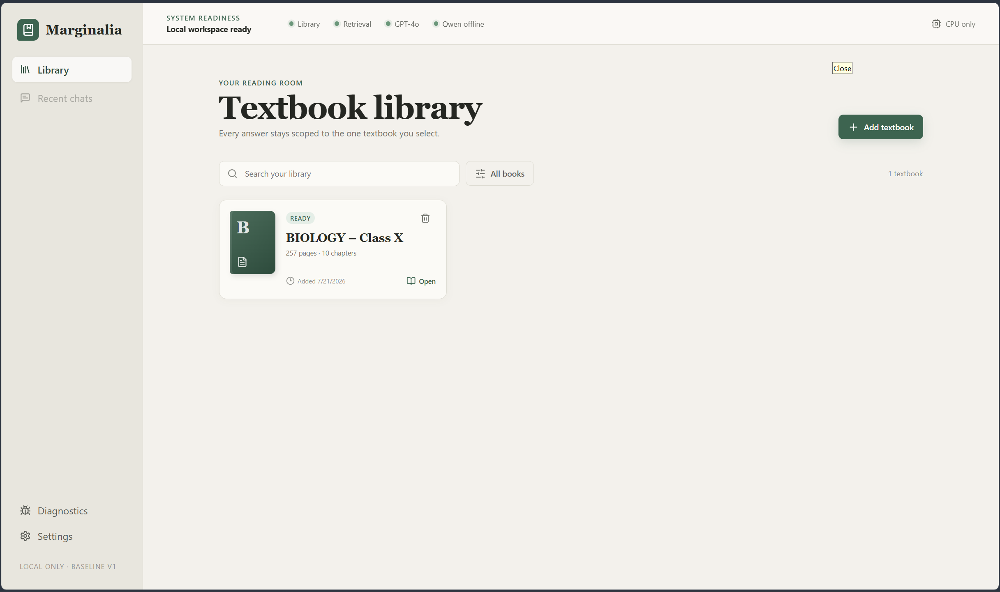
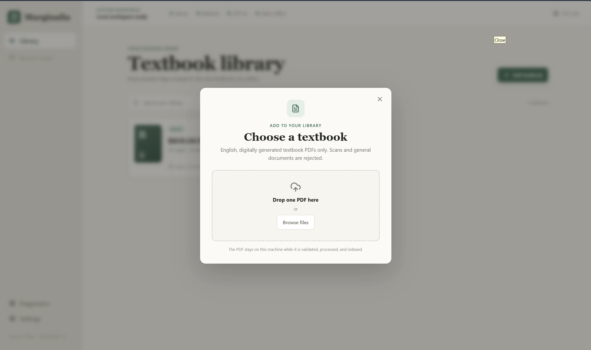
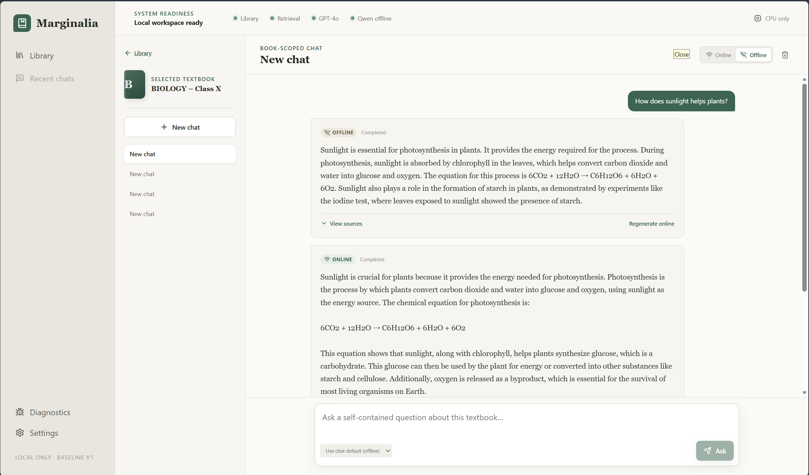
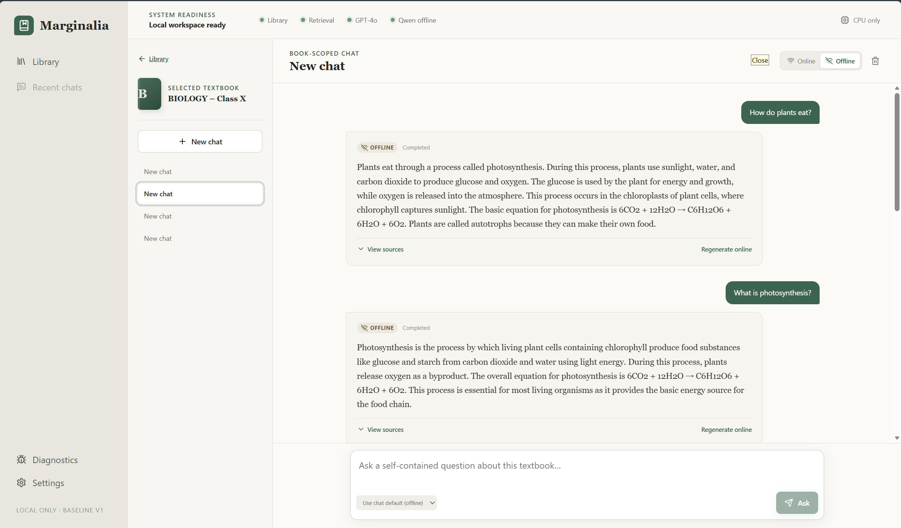
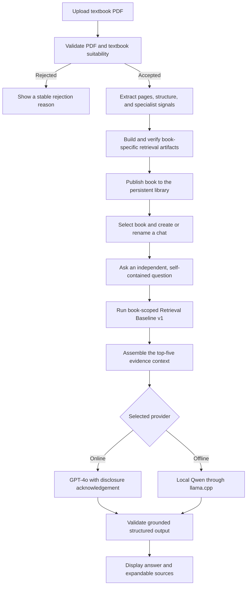

# Marginalia — Local Textbook RAG

Marginalia is a Windows-local chat application for asking grounded questions
about uploaded English textbooks. A user adds a digitally generated PDF, waits
for validation and indexing, selects that book, and starts independent
book-scoped conversations.

The application is built on the project's frozen research decisions:

| Layer | Frozen profile |
|---|---|
| Retrieval | Retrieval Baseline v1, including the researched formula, table, visual, and caption specialist signals |
| Online generation | `gpt-4o-2024-08-06`, retrieved top-5 context, 768-token limit |
| Offline generation | Qwen3-8B Q4_K_M through llama.cpp, retrieved top-5 context, 384-token limit |

The completed Local Model Comparison v1 tested Gemma 3 12B, gpt-oss-20b,
Phi-4 14B, and Granite 3.3 8B without changing those frozen profiles. None
passed the successive-narrowing gates, so Qwen3-8B remains the approved local
model. See `reports/local_model_comparison_v1/README.md`.

A subsequent isolated Qwen3.6-27B Q4_K_M investigation confirmed native ARM64
CPU and full Adreno OpenCL offload, but stopped at validity because latency and
memory were substantially worse than the Qwen3-8B control. See
`reports/local_model_comparison_v2_qwen36_27b/README.md`.

The first release is single-user, CPU-first, and bound to `127.0.0.1`. On the
validated Windows ARM64 hardware it can optionally run offline generation on
the Qualcomm Adreno GPU through OpenCL. It accepts English, text-layer textbook
PDFs that pass suitability checks; scans, papers, novels, reports, corrupt
PDFs, and poor extractions are rejected.

## Top-level flow

1. Upload a textbook PDF.
2. Validate its integrity, text layer, language, textbook structure, page map,
   and chapters.
3. Extract pages and specialist representations, build the frozen retrieval
   indexes, and publish the book atomically to the persistent library.
4. Create or select a chat that is permanently scoped to that book.
5. Ask a self-contained question and choose the online or offline generator.
6. Retrieve and assemble book evidence, generate a citation-constrained answer,
   and persist the message, answer attempt, diagnostics, and expandable sources.

Previous messages remain visible, but every question is retrieved and generated
independently. The application never uses the transcript as model history.

## Implementation overview

- **Backend:** FastAPI, Pydantic contracts, SQLite persistence, background
  ingestion/model-setup workers, and server-sent events for live progress.
- **Frontend:** React, TypeScript, Vite, TanStack Query, and a responsive
  persistent library/chat interface.
- **Retrieval:** uploaded-book adaptation of Retrieval Baseline v1 with pinned
  embeddings, BM25/dense fusion, specialist signals, reranking, and top-five
  context assembly.
- **Generation:** explicit per-chat and per-message provider selection. Online
  use requires disclosure acknowledgement; failures never trigger an automatic
  retry or provider switch.
- **Local runtime:** exact Qwen and Windows ARM64 llama.cpp artifacts are
  downloaded, checksum-verified, and reused. Runtime content lives under the
  Git-ignored `app_data/` directory. CPU remains the default and recommended
  production backend; `opencl_gpu` is an optional execution-only feature gate.

## Screenshots and demo

| Textbook library | Textbook upload |
|---|---|
|  |  |

| Online/offline comparison | Offline textbook chat |
|---|---|
|  |  |

[Watch the end-to-end retrieval and generation demo](docs/assets/demo/e2e-retrieval-generation.mp4)

## Repository structure

```text
config/                 Frozen retrieval and generation profiles
data/                   Reviewed benchmarks and reproducible research data
docs/                   UX plan, development guide, and repository guide
frontend/               React/TypeScript web client
reports/                Experiment results and baseline decision records
scripts/                App launcher and reproducible research entry points
src/textbook_chat/       FastAPI application and production RAG runtime
src/textbook_audit/      Extraction, retrieval, and generation research code
tests/                   Unit, integration, persistence, and regression tests
app_data/                Local books, indexes, models, SQLite DB, and logs (ignored)
```

### Main application files

| File | Purpose |
|---|---|
| `scripts/start_textbook_chat.py` | Windows launcher: builds the UI, checks dependencies and port, starts FastAPI, and opens the browser |
| `src/textbook_chat/app.py` | FastAPI factory, lifecycle, API registration, and compiled frontend hosting |
| `src/textbook_chat/services/ingestion.py` | Durable PDF validation, processing, indexing, and publication workflow |
| `src/textbook_chat/retrieval/runtime.py` | Book-scoped Retrieval Baseline v1 execution |
| `src/textbook_chat/services/chat.py` | Independent question, retrieval, generation, and streaming orchestration |
| `src/textbook_chat/generation/` | Frozen online/offline providers, prompt construction, and validation |
| `frontend/src/App.tsx` | Application shell, system readiness, diagnostics, and settings |
| `frontend/src/features/chat/ChatPage.tsx` | Chat list, renaming, provider controls, transcript, composer, and sources |

For deeper details, see [the UX plan](docs/UX_PLAN.md),
[application development guide](docs/APP_DEVELOPMENT.md), and
[repository guide](docs/REPOSITORY_GUIDE.md).

## Build and run

Requirements:

- Windows 10 or 11; the frozen offline runtime currently targets Windows ARM64
- x64 Python 3.10 or newer with a compatible PyTorch runtime
- Node.js and npm

From the repository root in PowerShell:

```powershell
python -m venv .venv
.\.venv\Scripts\Activate.ps1
python -m pip install --upgrade pip
python -m pip install -e ".[app,online-generation]"

Copy-Item .env.example .env
# Add OPENAI_API_KEY to .env only if online generation will be used.

cd frontend
npm ci
npm run build
cd ..

python scripts/start_textbook_chat.py
```

Open [http://127.0.0.1:8765](http://127.0.0.1:8765). The launcher opens this
address automatically. Use the in-app **Set up** action to download and verify
the frozen offline model/runtime when required.

## Offline CPU and OpenCL GPU backends

The operational setting is resolved only when the resident offline
`llama-server` starts. It changes the executable/backend arguments, not the
frozen pipeline: both paths use the same `Qwen3-8B-Q4_K_M.gguf`, retrieval,
top-five context, P1 prompt, seed, temperature, 384-token limit, and answer
validator.

The checked-in default is:

```yaml
offline_generation:
  backend: cpu
  allow_fallback: false
```

Edit `config/runtime.yaml`, or override it for one process:

```powershell
# Recommended/default CPU path
$env:TEXTBOOK_CHAT_OFFLINE_BACKEND = "cpu"
$env:TEXTBOOK_CHAT_OFFLINE_ALLOW_FALLBACK = "false"
python scripts/start_textbook_chat.py

# Validated Qualcomm Adreno OpenCL path
$env:TEXTBOOK_CHAT_OFFLINE_BACKEND = "opencl_gpu"
$env:TEXTBOOK_CHAT_OFFLINE_ALLOW_FALLBACK = "false"
python scripts/start_textbook_chat.py
```

Use the in-app offline setup after switching backends. The model is shared and
is not duplicated. CPU runtime files remain under
`app_data/models/llama.cpp/bin`; OpenCL runtime files are stored separately
under `app_data/models/llama.cpp/opencl_gpu/bin`. The OpenCL package is the
official native Windows ARM64 llama.cpp b10107 Adreno build and must contain
`llama-server.exe` and `ggml-opencl.dll`; setup verifies the release archive
checksum, executable build/commit, and every extracted file.

Inspect `GET /api/system/diagnostics` or `GET /api/system/offline/runtime` after
loading. The offline diagnostic reports:

- requested and active backend;
- llama.cpp build;
- selected device;
- offloaded and expected layer counts;
- initialization status and whether fallback occurred.

On `opencl_gpu`, startup succeeds only if the current llama.cpp log names
`Qualcomm(R) Adreno(TM) X1-85 GPU`, enables the Adreno kernels, and reports
`37/37` Qwen3-8B layers offloaded. Missing DLLs, an unsupported device,
incomplete offload, or startup failure produces an actionable error. It never
silently falls back. If `allow_fallback: true` is deliberately configured, the
GPU error and CPU fallback decision are both logged and exposed in diagnostics.

The validated hardware is Windows 11 ARM64 on Snapdragon X Elite X1E80100 with
Adreno X1-85. Qwen3-8B generated valid output with complete GPU offload, but
measured generation performance was currently similar to CPU (9.72 versus
9.53 tokens/s in the controlled proof). CPU therefore remains recommended.

Troubleshooting and rollback:

1. Confirm the OpenCL runtime setup completed and `ggml-opencl.dll` is present.
2. Load the provider, then inspect `/api/system/offline/runtime` for the exact
   initialization error and `logs/llama/llama_server.stderr.log` for device and
   offload lines.
3. Keep fallback disabled while diagnosing so a GPU failure cannot be hidden.
4. Roll back immediately by setting `backend: cpu` in `config/runtime.yaml` or
   `TEXTBOOK_CHAT_OFFLINE_BACKEND=cpu`, restart the API, and run offline setup
   only if the verified CPU runtime is absent. No frontend rebuild is needed.

For frontend development, run the API and Vite server in separate terminals:

```powershell
# Terminal 1
$env:PYTHONPATH = "src"
python -m uvicorn textbook_chat.app:app --host 127.0.0.1 --port 8765

# Terminal 2
cd frontend
npm run dev
```

Run the application checks with:

```powershell
python -m pytest -q
cd frontend
npm run typecheck
npm run build
```

## Workflow


